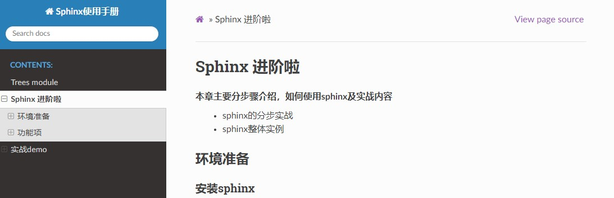
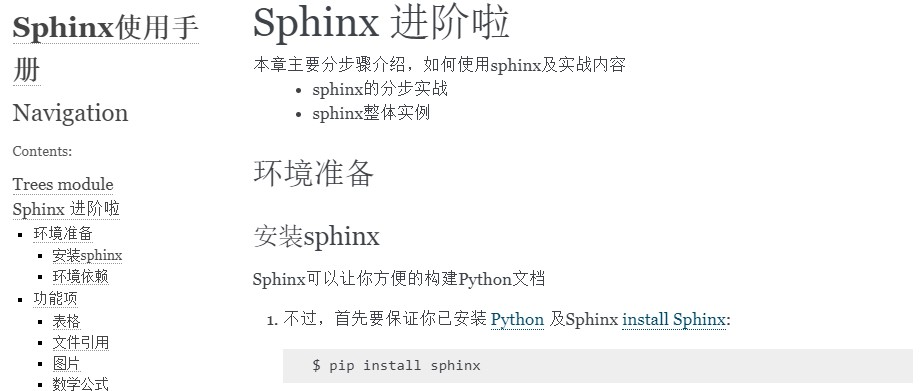
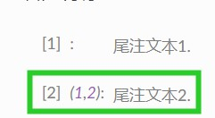
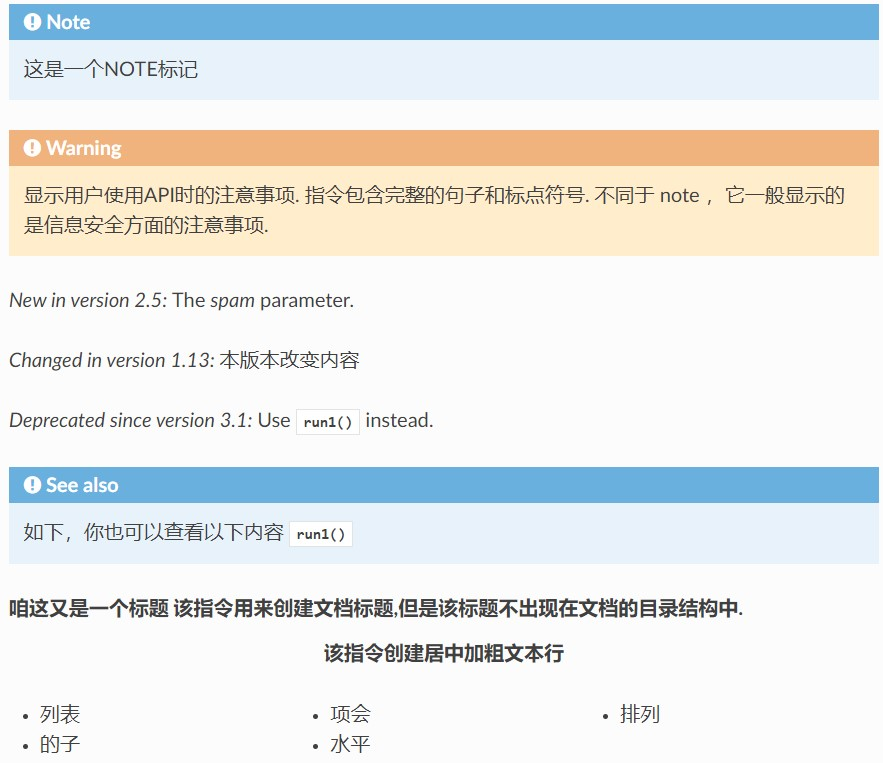

.. _start:

=================
Sphinx 进阶啦
=================

本章主要分步骤介绍，如何使用sphinx及实战内容
    * sphinx的分步实战
    * sphinx整体实例

环境准备
==================================

安装sphinx
-----------
Sphinx可以让你方便的构建Python文档

#. 不过，首先要保证你已安装 Python_ 及Sphinx `install Sphinx`_::

    $ pip install sphinx

#. 在你的项目文件下创建docs文件夹::

    $ cd /path/to/youpackage
    $ mkdir docs

#. 如下，运行 ``sphinx-quickstart`` ::

    $ cd docs
    $ sphinx-quickstart

.. note::
    当你干完了这些，你将会获得 ``index.rst`` 和 ``conf.py`` 以及其他的一些文件
        * 修改 ``conf.py`` 文件更新配置
        * 修改 ``index.rst`` 文件

环境依赖
--------
.. 本节主要简单介绍涉及到的相关Python库

设置环境依赖，主要包括Python版本、环境版本等，其中关于表格 :ref:`表格说明 <table-label>`

=====================  ======================================================
库名                   功能
=====================  ======================================================     
``sphinx-rtd-theme``     设置生成HTML主题，``Python库``
    ``Pygments``       Python代码块使用
=====================  ======================================================

Python包版本
^^^^^^^^^^^^^
设置环境依赖，主要包括Python版本、环境版本等::

    sphinx-rtd-theme 1.0.0
    Pygments 2.12.0

功能项
==================================
本节，主要介绍Sphinx的一些基本功能，
    * 比如 :ref:`表格 <table-label>`、:ref:`文件引用 <file-label>`、:ref:`数学表达式 <math-label>`、:ref:`html主题 <theme-label>`、:ref:`拓展项 <extension-label>`
    
.. _table-label:

表格
--------

1. 复杂表格，可自定义表格的边框

+------------------------+------------+----------+----------+
| Header row, column 1   | Header 2   | Header 3 | Header 4 |
| (header rows optional) |            |          |          |
+========================+============+==========+==========+
| body row 1, column 1   | column 2   | column 3 | column 4 |
+------------------------+------------+----------+----------+
| body row 2             | ...        | ...      |          |
+------------------------+------------+----------+----------+

2. 简单表格: 需要有多行

=====  =====  =======
A      B      A and B
=====  =====  =======
False  False  False
True   False  False
False  True   False
True   True   你说呢
=====  =====  =======

3. csv表格

.. code-block:: RST

    .. csv-table:: csv表格示例
        :header-rows: 2
        :stub-columns: 1

          ,xmin,xmax,xsteps
        state, , ,
        battery,0,3,4
        
* 结果

.. csv-table:: csv表格示例
    :header-rows: 2
    :stub-columns: 1

      ,xmin,xmax,xsteps
    state, , ,
    battery,0,3,4

.. _file-label:

文件引用
--------
.. note::
       如下，主要介绍如何在文档中引用Python文件
       
       
方法1：从文件中引用
^^^^^^^^^^^^^^^^^^^^^^^^^^^^

    #. 其中，**路径为docs/source相对引用文件的相对路径**
    #. 语言为Python，编码方式为utf-8
    #. 高亮第1,678行
    #. 展示行号
    #. 选择要展示的函数

.. code-block:: RST

    .. literalinclude:: ../../BootstrapFilter/BootstrapFilter.py
        :language: Python
        :emphasize-lines: 1,6-8
        :encoding: utf-8
        :linenos:
        :pyobject: BootstrapFilter.run

* 结果
    * 另外，此处可以通过 ``:lines: 1-12`` 来实现只引用部分行的脚本
    * 通过 ``:end-before: train word2vec`` 或 ``start-after`` 来实现只引用从什么开头或者到什么结尾的脚本

.. literalinclude:: ../../BootstrapFilter/BootstrapFilter.py
    :language: Python
    :emphasize-lines: 1,6-8
    :encoding: utf-8
    :linenos:
    :pyobject: BootstrapFilter.run

方法2：直接上手Python脚本
^^^^^^^^^^^^^^^^^^^^^^^^^^^^

    #. 手写代码块，并特定列加重
    #. 语言为Python
    #. 高亮第3,5行
    
.. code-block:: RST

    .. code-block:: python
       :emphasize-lines: 3,5

       def some_function():
           interesting = False
           print 'This line is highlighted.'
           print 'This one is not...'
           print '...but this one is.'

* 结果

.. code-block:: python
   :emphasize-lines: 3,5

   def some_function():
       interesting = False
       print 'This line is highlighted.'
       print 'This one is not...'
       print '...but this one is.'

   
方法3：交叉引用
^^^^^^^^^^^^^^^^^^^^^^^^^^^^
 .. py:function:: run1

.. py:class:: BootstrapFilter1
    .. py:function:: run1()
   :noindex:
   
   * 本文目标函数
   * **跳转到本文的第一个run1函数**， :func:`run1`.
   
    
.. py:method:: BootstrapFilter1.run1()
   :noindex:

方法4：直接autoclass
^^^^^^^^^^^^^^^^^^^^^^^^^^^^
.. code-block:: RST

    .. autoclass:: BootstrapFilter.BootstrapFilter.BootstrapFilter
        :noindex:
        :members:
        :undoc-members:

图片
--------
1. 图片
    * 如下图，我们引用了一张图片
    * 图片路径，可以为绝对路径或相对路径，一般而言**图片放到docs/source文件夹下的pic文件下**
    * 可以添加各种表格参数

.. code-block:: RST

    .. figure:: ./sphinx_pics/sphinx_图片示例.jpg
       :width: 60%
       :align: center

       图片示例

* 结果

   
   图片示例

.. _math-label:

数学公式
--------

.. code-block:: RST

    文本中 :math:`p(x_t \mid x_{t-1})` 的公式你懂的
    文本外如下：

    .. math:: p(x_t \mid x_{t-1})  \quad p(y_t \mid x_t) \quad p(x_0)

* 结果

    1. 文本中 :math:`p(x_t \mid x_{t-1})`
    2. 文本外

.. math:: p(x_t \mid x_{t-1})  \quad p(y_t \mid x_t) \quad p(x_0)

.. _theme-label:

html主题
--------
.. note::
       * 如下，可以选择好看的主题嘞，一般在 ``conf.py`` 文件中修改 ``html_theme`` 即可
       * 默认为 ``alabaster`` , 其他可选的还有，``nature/classic/sphinxdoc/pyramid/traditional``
       * 我们一般选择 ``sphinx_rtd_theme`` 这个主题需要离线下载 [#f2]_

.. code-block:: RST

    .. literalinclude:: conf.py
        :language: Python
        :emphasize-lines: 4 为选择片段的相对行数
        :encoding: utf-8
        :linenos:
        :lines: 58-62

.. literalinclude:: conf.py
    :language: Python
    :emphasize-lines: 6
    :encoding: utf-8
    :linenos:
    :lines: 56-62

* 结果

   
   html风格：sphinx_风格sphinx_rtd_theme
   

    
   html风格：sphinx_风格ablaster
    

.. _extension-label:

Extension
-----------

.. note::
       * 这部分还是比较重要的，部分重要的拓展项，可以让我们生成的文档更加美观
       * ``sphinx.ext.autodoc`` 自动文档
       * ``sphinx.ext.mathjax`` 数学表达式
       * ``sphinx.ext.viewcode`` 从文档链接到代码源码
       * ``sphinx.ext.napoleon`` 让sphinx可以解析你写的numpy或Google格式的Py注释
       * 具体的，可参考帮助文档  `sphinx theme napoleon`_

个人的extensions引用如下::

    extensions = ['sphinx.ext.autodoc',
        "IPython.sphinxext.ipython_directive",
        "IPython.sphinxext.ipython_console_highlighting",
        "sphinx.ext.autosummary",
        'sphinx.ext.viewcode',
        'sphinx.ext.doctest',
        'sphinx.ext.intersphinx',
        'sphinx.ext.todo',
        'sphinx.ext.coverage',
        'sphinx.ext.mathjax',
        'sphinx.ext.napoleon']
        
        
        
尾注引用
-----------
.. note::
    * 脚注及索引使用
        * 这是一个尾注嘛，**需要在为主后加一下划线**，你懂的 [#f2]_ 且，多个尾注使用了会在文章末尾标记
        * 而这，是一个索引，**需要在索引前的下划线换成索引后的**，`Python`_

.. code-block:: RST

    这是一个尾注嘛，你懂的 [#f2]_
    二者，是一个索引，`Python`_
    
    .. [#f1] 尾注文本1.
    .. [#f2] 尾注文本2.
    .. _Python: https://www.python.org/

* 结果示例

    
   sphinx_尾注

目录树
-----------
* Sphinx 使用自定义的指令在独立文件里添加这种关系或目录表格. **指令 toctree 是其核心元素.**
    1. 该指令在当前位置插入一个目录树 “TOC tree” ,在文档中使用独立的 TOCs (包括 “sub-TOC trees”)给出指令的主体. 
    2. 相对文件名 (不以缩写开头) 是指令所在的文件的相对路径，绝对文件名则以源目录为根目录. 数值 maxdepth 选项指定目录的层次，默认包含所有的层次.

* 下面是一个例子
    * 插入所有文档的目录，深度为2表示文档必须有一个标题. 这些文档内的指令 toctree 也会被插入.
    * Sphinx 确定了 user_guide, demo_pdf 这几个字符串在文档中的相对顺序，并知道它们是本文档的子页面，是文档库的索引. 
        * **根据这些信息可产生 “下一个主题”, “上一个主题” 及 “父页面” 的链接.**
        * ``output_pdf <demo_pdf>`` 尖括号外的是新的标签

.. code-block:: RST

    .. toctree::
        :maxdepth: 2
        :numbered: 2 这个是为章节编号
        :titlesonly:  只出现文档的标题，不出现文中其他同等级的标题行
        :glob:  可用文档列表里的所有条目都会被匹配， 并且按照字母顺序插入
        :hidden: 不会在当前位置插入目录树，不过目录在HTML边框栏里仍然体现
    
        user_guide
        sphinx_start <self> 表示文件自己
        output_pdf <demo_pdf>

.. toctree::
    :maxdepth: 2
    :numbered:

    user_guide
    learing_sphinx <self>
    output_pdf <demo_pdf>

标记项
-----------
* 主要包括段落级别的标记和目录表格标记

.. note::
    * 此处，需要注意的是，可直接以 **标题名称+下划线** 引用对应标题，比如查看 `功能项`_
    * 而 ``ref`` 则不能直接引用标题 ``:ref:`测试again <目录表格标记>`` ；但是可以引用 :ref:`文件引用 <file-label>` 
    * ** ``term`` 来引用 ``glossary`` ** 的组合，则可以全局索引 :term:`项目根路径 <source directory>`

段落级别的标记
^^^^^^^^^^^^^^^^^^^^^^^^^^^^

* 本节主要包括NOTE、WARNING标记等，以及一些版本说明的标记项

.. code-block:: RST

    .. note::
        这是一个NOTE标记 

    .. warning::
        显示用户使用API时的注意事项. 指令包含完整的句子和标点符号. 不同于 note ，它一般显示的是信息安全方面的注意事项.

    .. versionadded:: 2.5
       The *spam* parameter.

    .. versionchanged:: 1.13
        本版本改变内容

    .. deprecated:: 3.1
       Use :func:`run1` instead.

    .. seealso::
        如下，你也可以查看以下内容 :py:func:`run1`

    .. rubric:: 咱这又是一个标题
        该指令用来创建文档标题,但是该标题不出现在文档的目录结构中.

    .. centered::
        该指令创建居中加粗文本行

    .. hlist::
       :columns: 3

       * 列表
       * 的子
       * 项会
       * 水平
       * 排列

* 结果如下图

    
   标记段落级别

目录表格标记
^^^^^^^^^^^^^^^^^^^^^^^^^^^^

1. ``glossary`` 该指令必然包含一个reST式的定义列表标记，由术语和定义组成. 这些定义其后可被 ``term`` 引用.

.. code-block:: RST

    .. glossary::

       environment
          一个结构，包含信息是所有文档的保存路径，使用的参考文献等.
          在解析的阶段使用，因此连续运行时仅需解析新的或修改过的文档.

       source directory
          根路径，包含子目录，包含一个Sphinx工程的所有源文件.

.. glossary::

   environment
      一个结构，包含信息是所有文档的保存路径，使用的参考文献等.
      在解析的阶段使用，因此连续运行时仅需解析新的或修改过的文档.

   source directory
      根路径，包含子目录，包含一个Sphinx工程的所有源文件.
          

如下，即为通过 ``:term:`` 来引用 ``glossary`` 创建的全局标记，可通过 :term:`项目根路径 <source directory>` 来定位

.. index::
   single: execution; context
   module: __main__
   module: sys
   triple: 尾注引用; 目录树; 目录表格标记

自定义摘要
-----------
.. note::
    * 自定义摘要，结合template，可以进一步生成文档
        * 其中autosummary可以参考， ``sphinx autosummary``
        * 而template则可以参考， ``custom template``

下面的即为template中可用的变量：

.. currentmodule:: None

.. data:: name

    已记录对象的名称，不包括模块和类部件。

.. data:: objname

    已记录对象的名称，不包括模块部件。

.. data:: fullname

    已记录对象的全名，包括模块和类部件。

.. data:: module

    记录的对象所属的模块的名称

.. data:: class

   需要生成文档的对象名称，仅包括类，且只有方法methods和属性attributes

.. data:: underline

   对于注释文本中包含 ``len(full_name) * '='`` ，的使用 ``underline`` 将其挑选出来

.. data:: members

   包含模块或类的所有成员名称的列表。 仅适用于模块和类。

.. data:: inherited_members

   包含类的所有继承成员的名称的列表。 仅适用于类

   .. versionadded:: 1.8.0

.. data:: functions

   包含模块module中 "public" 函数function名称的列表。仅适用于模块module
   **此处的"public"表示的是函数名称不以下划线开头，表示非私有的意思哦**

.. data:: classes

   包含模块module中 "public" 类class名称的列表。仅适用于模块module

.. data:: exceptions

    包含模块module中 "public" 异常exceptions名称的列表。仅适用于模块module

.. data:: methods

    包含class中 "public" 方法methods名称的列表。仅适用于类class

.. data:: attributes

    包含class中 "public" 属性attributes名称的列表。仅适用于类class

.. note::
    更进一步，如下的这些filter也是可用的

.. code-block:: RST

   .. function:: escape(s)
    
       * 转义要在格式化RST上下文中使用的文本中的任何特殊字符。
       * 例如，这可以防止星号使事情变得大胆。这取代了内置的Jinja的 `escape filter` ，后者它可以进行 html-escaping 

   .. function:: underline(s, line='=')

       为一段文本添加标题下划线

示例
^^^^^^^^^^^^^^^^^^^^^^^^^^^^

比如使用, ``{{ fullname | escape | underline }}`` 应该用于生成页面的标题

.. [#f1] 尾注文本1.
.. [#f2] 尾注文本2.
.. _a screencast: https://www.youtube.com/watch?feature=player_embedded&v=oJsUvBQyHBs
.. _sphinx theme napoleon: http://www.sphinx-doc.org/en/master/ext/napoleon.html
.. _getting started at readthedocs: http://docs.readthedocs.io/en/latest/getting_started.html#
.. _install Sphinx: http://sphinx-doc.org/latest/install.html
.. _sphinx autosummary: https://sphinx-doc.readthedocs.io/zh_CN/master/usage/extensions/autosummary.html
.. _custom template: https://sphinx-doc.readthedocs.io/zh_CN/master/usage/extensions/autosummary.html#customizing-templates
.. _Python: https://www.python.org/
.. _reStructuredText: http://sphinx-doc.org/rest.html
.. _this template: http://docs.writethedocs.org/guide/writing/beginners-guide-to-docs/#id1
.. _available html themes: http://www.sphinx-doc.org/en/stable/theming.html#builtin-themes
.. _sphinx documentation for config.py: http://www.sphinx-doc.org/en/stable/config.html
.. _Math support in sphinx: http://www.sphinx-doc.org/en/master/ext/math.html

